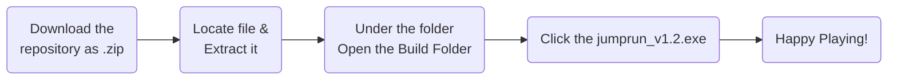
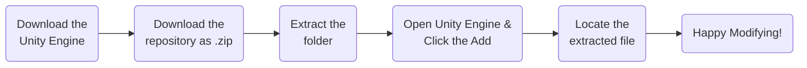

# JumpRun v1.2
Introducing JumpRun version 1.2. This a simple 2D platformer game made in Unity Engine and coded in C# programming language.
This game was develop by __mikerusensei__, the owner of this repository. Its purpose was to showcase the basics of Unity Engine and
it may cure your boredom while waiting to something. Unfortunately, it is only compatible in computers. If you want to have this
software, please refer to `directions` to have this software.

## Update
Fix collision bug in Level 01 and adjust the spawn of character at the start of every level.

## Pre-requisites
### For playing
* Windows Operating System (64-bit architecture)

### For modifying
* Windows Operating System (64-bit architecture)
* Unity Engine w/ [Editor Version - 2021.3.34f1]
* Visual Studio 2022 w/ [Unity Package Installed]

## Special Thanks
Special thanks to the people who help to create this software.

* MoreBBlakeyyy - <https://www.youtube.com/@morebblakeyyy>
* GDTitans - <https://www.youtube.com/@GDTitans>
* Hooson - <https://www.youtube.com/@hoosontech>
* Game Maker's Toolkit - <https://www.youtube.com/@GMTK>
* Unity Mechanics - <https://www.youtube.com/@UnityMechanics>
  
Without them, this game is not possible.

## Resources
Here's the source of the resources used in the game.

* Itch IO - <https://itch.io/>
* LYASeek - <https://lyaseek.itch.io/> | Characters - <https://lyaseek.itch.io/minifvillagers>
* AxulArt - <https://axulart.itch.io/> | Tile Map - <https://axulart.itch.io/dirt-and-grass-2d-platform-tileset>
* SeekPNG - <https://www.seekpng.com/> | Coin - <https://www.seekpng.com/png/detail/442-4426319_coin-sprite-sheet-pixel-art.png>

All of the resources used was completely free of use and you can use it in your project, just give them the rightful
credit because they are the one who made this art/spritesheet.

## Directions
### To Play the Game
To have this game/software, please follow the flowchart diagram below.

If you are having issues please contact mikerusensei for further assistance. Contact is in his profile.

### To Modify the Game
If you want to modify the game, feel free to do it just give credit. To modify the game, please refer to the flowcart diagram below.

If you are having issues please contact mikerusensei for further assistance. Contact is in his profile.

## License
The `jumprun` is an open-sourced software licensed under the [MIT License](http://opensource.org/licenses/MIT).

